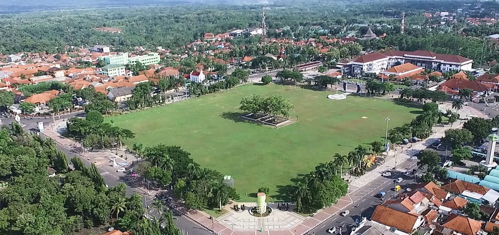

<!--StartFragment-->

Purworejo adalah sebuah kabupaten di Provinsi Jawa Tengah. Kabupaten ini berbatasan dengan Kabupaten Wonosobo dan Kabupaten Magelang di utara, Kabupaten Kulon Progo (Provinsi Daerah Istimewa Yogyakarta di timur), Samudra Hindia di selatan, serta Kabupaten Kebumen di sebelah barat.

Kabupaten Purworejo Kabupaten Purworejo terletak pada posisi 109o 47’28” – 110o 8’20” Bujur Timur dan 7o 32’ – 7o 54 Lintang Selatan.

Purworejo memiliki banyak tempat wisata seperti goa seplawan, pantai jatimalang, air terjun sidandang dan masih banyak lagi. Purworejo memiliki kuliner daerah yang menjadi ciri khas, yaitu clorot, geblek, dawet hitam, dan masih banyak yang lainnya, Purworejo mempunyai kesenian daerah yang bisa dijadikan icon yaitu tari Dolalak. Purworejo juga merupakan daerah Asal pahlawan-pahlawan dan orang-orang terkenal, seperti Sarwo Edhi Wibowo, W.R Soepratman dan juga Bapak Gubernur kita yang tercinta Ganjar Pranowo

<!--EndFragment-->